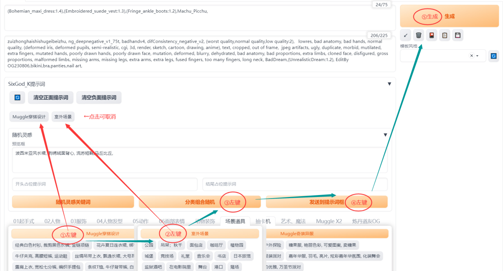

# v1.75
### 老版词库 @路过银河&网上收集
### 新词库由群里小伙伴 @麻瓜 @万碎爷 @元一斤 整理
### 开源不易，觉得好用的可以给我点颗星 ###
#### 英文不好不用怕！彻底解决prompt对于国人不友好的痛点，整理了多个分类上千个提示词，无需英文快速输入提示词
#### 词库会持续更新
* AI交流Q群390942276 各种疑难解答 帮你踩坑
* 已分好类别的词库，不会做太大改动，尽量不破坏大家的使用习惯

--- 
* 特别鸣谢群里兄弟们的支持
  <p> @鑫鑫、@六尘、@以及不愿意透露姓名的水友们</p>
 

# 
### 插件安装
  * webui、forge版本  
  ```sh
     https://github.com/thisjam/sd-webui-oldsix-prompt.git
  ```
  * comfyui版本
 ```sh
    https://github.com/thisjam/comfyui-sixgod_prompt.git
 ```
--- 
### 使用方法
  *  alt+q或点击图标打开插件页面
  *  左键输入正向提示框、 右键输入负向提示框
  *  支持自定义词库【把你自己整理词库文件放在yours文件夹下，不受更新会被覆盖影响】
  *  支持中文输入、权重调整、位置调整。Alt+Q键呼出隐藏面板
  *  支持动态随机提示词    本插件专属语法示例：#[red,blue,yellow]
    
  
  ---
### 大模型配置（可用于翻译和随机灵感）
1. 安装 llama_cpp_python

   * 方式一、参考：https://github.com/abetlen/llama-cpp-python
   * 方式二、llama-cpp-python的gpu离线包下载地址，自行下载对于版本下载安装
    	- https://abetlen.github.io/llama-cpp-python/whl/cu121/
    	- https://abetlen.github.io/llama-cpp-python/whl/cu122/
    	- https://abetlen.github.io/llama-cpp-python/whl/cu123/
    	- https://abetlen.github.io/llama-cpp-python/whl/cu124/
3. 大模型下载（需要.gguf格式）
   * 建议千问大模型，推荐qwen1_5-4b-chat-q2_k.gguf
   * 地址：https://huggingface.co/Qwen
     
 ---  
 ### 展示
 # 
 # 


 

