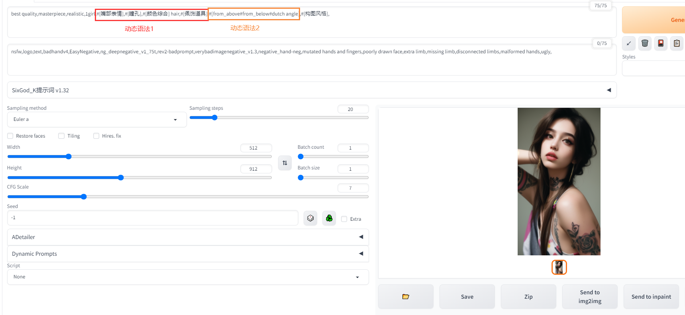
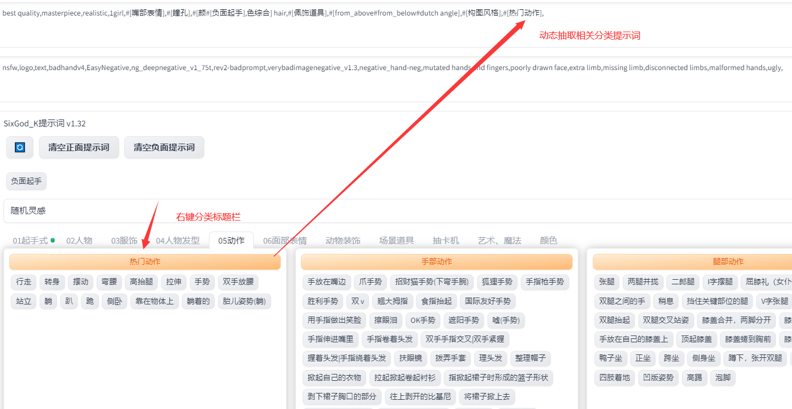


 
# sd-webui-oldsix_prompt v1.32
### 新词库由群里小伙伴 @麻瓜 @万碎爷 @元一斤 整理
### 100%完全自制插件，不是魔改别人，最近有个别up未均本人允许，在多个平台打着nsfw词库的旗号拿本插件吸粉入群，别人安装插件出问题又无法提供解决方案 ###
### 本插件前前后后花了大半个月，阅读大量英文文档，研究了大量代码，最后才开发完成，觉得好用的可以给我点颗星。
###
#### 英文不好不用怕！彻底解决prompt对于国人不友好的痛点，整理了多个分类上千个提示词，无需英文快速输入提示词
#### 词库会持续更新
* AI交流Q群875376246 各种疑难解答 帮你踩坑
* 已分好类别的词库，不会做太大改动，尽量不破坏大家的使用习惯

--- 
### 安装方法
  * 方法1、复制地址到你的webui中 从网站安装后应用并重启 
  ```sh
     https://github.com/thisjam/sd-webui-oldsix-prompt.git
  ```
  * 方法2、 如果webui中无法安装的可以选择手动安装，点击页面上的code->DownloadZip 解压以后放在你的sd文件夹下的extensions文件夹后应用并重启   
--- 
### 使用方法
  *  左键输入正向提示框、 右键输入负向提示框
  *  支持随机抽卡 【灵感模式、分类随机模式】
  *  支持动态随机提示词    本插件专属语法示例：#[red#blue#yellow] 或#[日常服饰]
  ---
  ##### 展示1  
  
  ##### 展示2 
  
  ##### 展示3
  
  ##### 展示4
  

